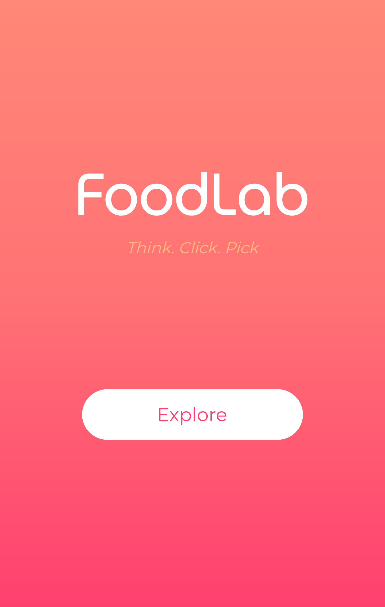
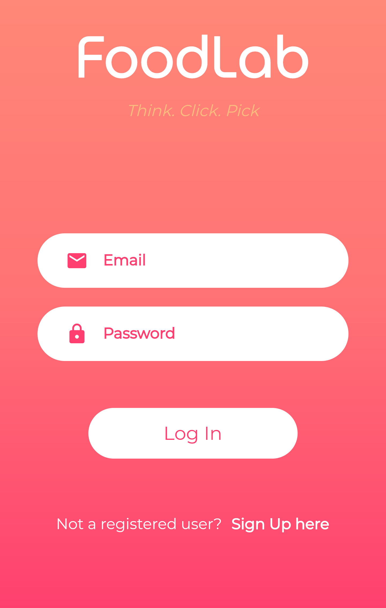
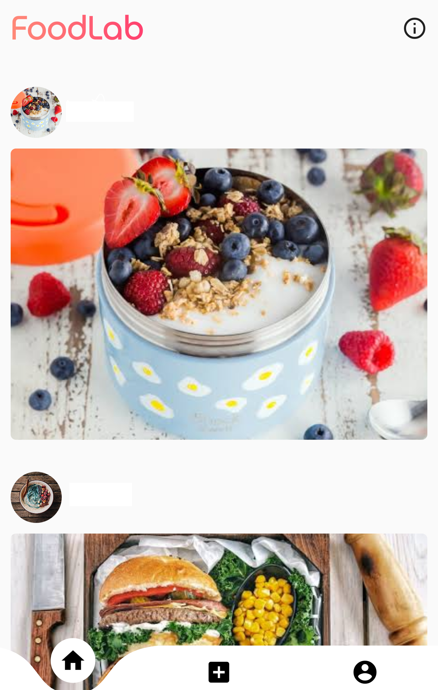
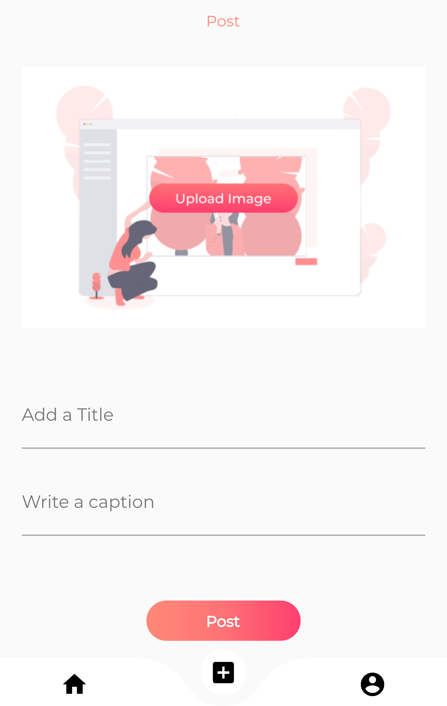
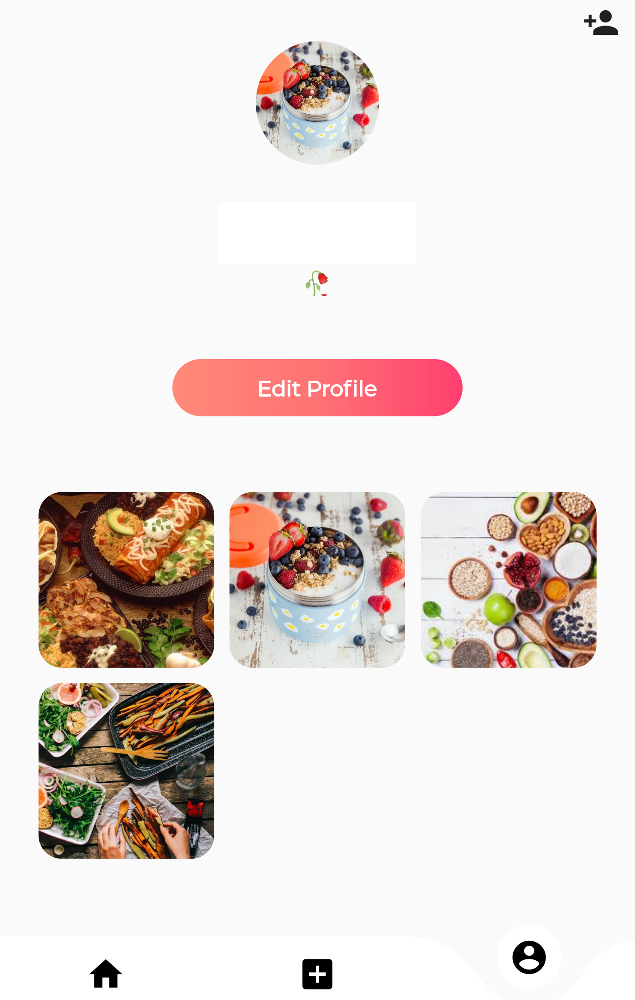

  

 
<i>A Food App using <a href="https://flutter.dev/">Flutter </a> 
  
  

  -  is a App to post and view food blogs along with their recipes if you want 🤤!
  
  - Login or SignUp using any account 
  

  
## Screens 😍

  

## In Action 👀

  

  
